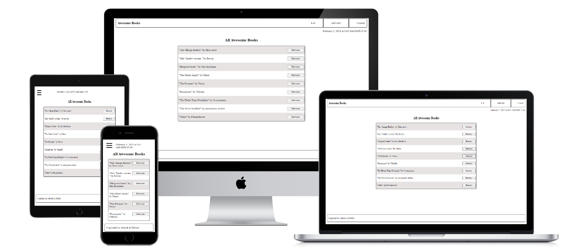

<a name="readme-top"></a>
<!-- the change -->
<div align="center">
  
  
  <br/>
  <h1><b>Awesome Books</b><br><br></h1>
  
 </div>
<div align="center">
  
</div>

<!-- TABLE OF CONTENTS -->

# 📗 Table of Contents

- [📖 About the Project](#about-project)
  - [🧪 Linters And Deployment](#linters)
  - [🛠 Built With](#built-with)
    - [Tech Stack](#tech-stack)
    - [Key Features](#key-features)
  - [🚀 Live Demo](#live-demo)
- [💻 Getting Started](#getting-started)
  - [Setup](#setup)
  - [Prerequisites](#prerequisites)
  - [Install](#install)
  - [Usage](#usage)
  - [Run tests](#run-tests)
  - [Deployment](#triangular_flag_on_post-deployment)
- [👥 Authors](#authors)
- [🔭 Future Features](#future-features)
- [🤝 Contributing](#contributing)
- [⭐️ Show your support](#support)
- [🙏 Acknowledgements](#acknowledgements)
- [📝 License](#license)

<!-- PROJECT DESCRIPTION -->

# 📖 Awesome Books <a name="about-project"></a>

This Project for individual purpose and it organize your fav books

**Awesome Books** is just a javascript based simple project

## 🧪 Linters And Deployment <a name="linters"></a>
[](https://github.com/PowerLevel9000/Awesome-Books/actions/workflows/linters.yml)[](https://github.com/PowerLevel9000/Awesome-Books/actions/workflows/pages/pages-build-deployment)

## 🛠 Built With <a name="built-with"></a>

### Tech Stack <a name="tech-stack"></a>

In this project we used many skills, tech and libraries

<details>
  <summary>Documentation</summary>
  <ul>
    <li><a href="https://html.com">HTML</a></li>
  </ul>
</details>

<details>
  <summary>Styling</summary>
  <ul>
    <li><a href="https://www.w3.org">CSS</a></li>
  </ul>
</details>

<details>
<summary>Dynamics And Logics</summary>
  <ul>
    <li><a href="https://www.javascript.com/">JavaScript</a></li>
  </ul>
</details>

### Key Features <a name="key-features"></a>

> Following features you should observe

- **You can add your fav book**
- **Yoc can remove it if you loose interest or mood swings**


<p align="right">(<a href="#readme-top">back to top</a>)</p>

<!-- LIVE DEMO -->

## 🚀 Live Demo <a name="live-demo"></a>

> This link will guide you to my project

- [Live Demo Link](https://powerlevel9000.github.io/Awesome-Books/dist/)


<p align="right">(<a href="#readme-top">back to top</a>)</p>

<!-- GETTING STARTED -->
## 💻 Getting Started <a name="getting-started"></a>

For having local file and project you can fork this repo or clone it using `git clone https://github.com/PowerLevel9000/Awesome-Books.git`
And for making changes you you should follow prerequisites


### Prerequisites

In order to edit this project you need:

 - Any text editor such as note pad and word pad
 - A web browser
 - Node js installed
 - An IDE

#### Suggested IDE
 - Visual studio code `I prefer this one 🙃🙃`
 - Atom 
 - Sublime 
 - IntelliJ IDEA
 - Visual code 

### Setup

Clone this repository to your desired folder:

- Open your terminal there (bash cmd powershell run etc...) and run `npm i` to install node modules
- `npm run dev` or `npm run start` this will open project in browser
- If you to edit something edit in src dir and then run in terminal `npm run build` to build it for production

- Before deployment have some linter check 
  - [ ] `npx stylelint "**/*.{css,scss}"` for css and saas file
  - [ ] `npx eslint .` for js files
  - [ ] `npx hint .` for html files 

- After fixing error build deploy for production

### Install 
```
npm i 
```
### Usage

  - Navigation bar using SPA
  - Book added to shelf


### Run tests

- Check whether your fav book added 
- Check your mood swings works 🧑‍🏫😁 according to my project
 

### Deployment

You can deploy this project using:

- for this repo and use git hub pages to deploy it 

<p align="right">(<a href="#readme-top">back to top</a>)</p>

<!-- AUTHORS -->

## 👥 Authors <a name="authors"></a>


👤 **Adarsh Pathak**

- GitHub: [@PowerLevel9000](https://github.com/githubhandle)
- Twitter: [@PowerLevel9002](https://twitter.com/PowerLevel9002?t=AIuSN7mTxk5a_MWpLolEjA&s=09)
- LinkedIn: [@Adarsh Pathak](https://www.linkedin.com/in/adarsh-pathak-56a831256/)

👤 **Dilsher Balouch**

- GitHub: [@DilsherB](https://github.com/DilsherB)
- Twitter: [@_brilliantMindz](https://twitter.com/_brilliantMindz)
- LinkedIn: [@_brilliantMindz](https://www.linkedin.com/in/brilliantmindz/)


<!-- FUTURE FEATURES -->

## 🔭 Future Features <a name="future-features"></a>

- [ ] **Add navigation bar**
- [ ] **improve functionality**
- [ ] **improve styling**

<p align="right">(<a href="#readme-top">back to top</a>)</p>

<!-- CONTRIBUTING -->

## 🤝 Contributing <a name="contributing"></a>

Contributions, issues, and feature requests are welcome!

Feel free to check the [issues page](https://github.com/PowerLevel9000/Awesome-Books/issues)).

<p align="right">(<a href="#readme-top">back to top</a>)</p>

<!-- SUPPORT -->

## ⭐️ Show your support <a name="support"></a>


If you like my Project give it a Star ✨🌟 

<p align="right">(<a href="#readme-top">back to top</a>)</p>

<!-- ACKNOWLEDGEMENTS -->

## 🙏 Acknowledgments <a name="acknowledgements"></a>

I want to thank Microverse for giving me opportunity to show my skills
<p align="right">(<a href="#readme-top">back to top</a>)</p> 


<!-- LICENSE -->

## 📝 License <a name="license"></a>

This project is [MIT](https://github.com/PowerLevel9000/Awesome-Books/blob/master/MIT.md) licensed.


<p align="right">(<a href="#readme-top">back to top</a>)</p>
